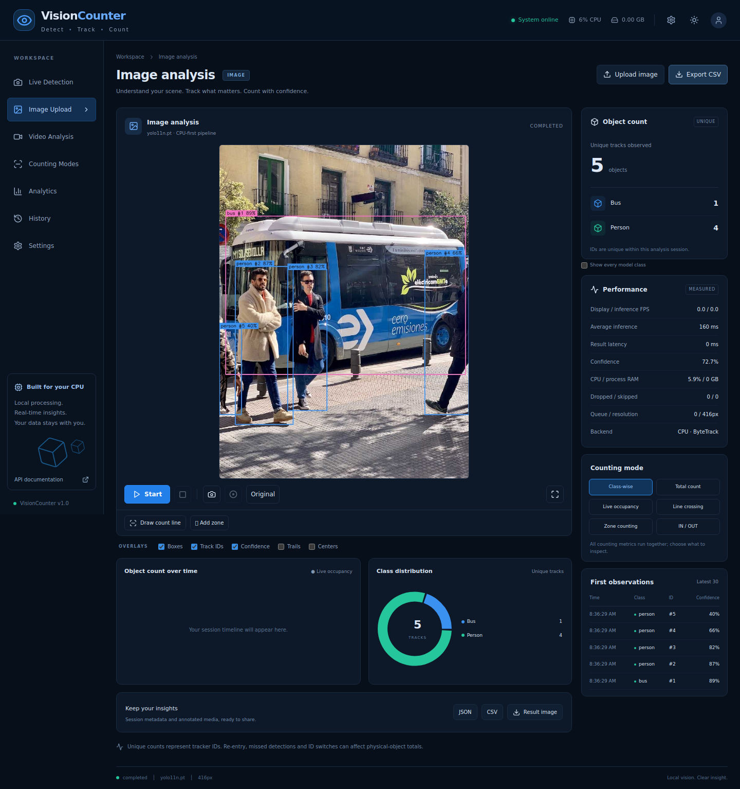
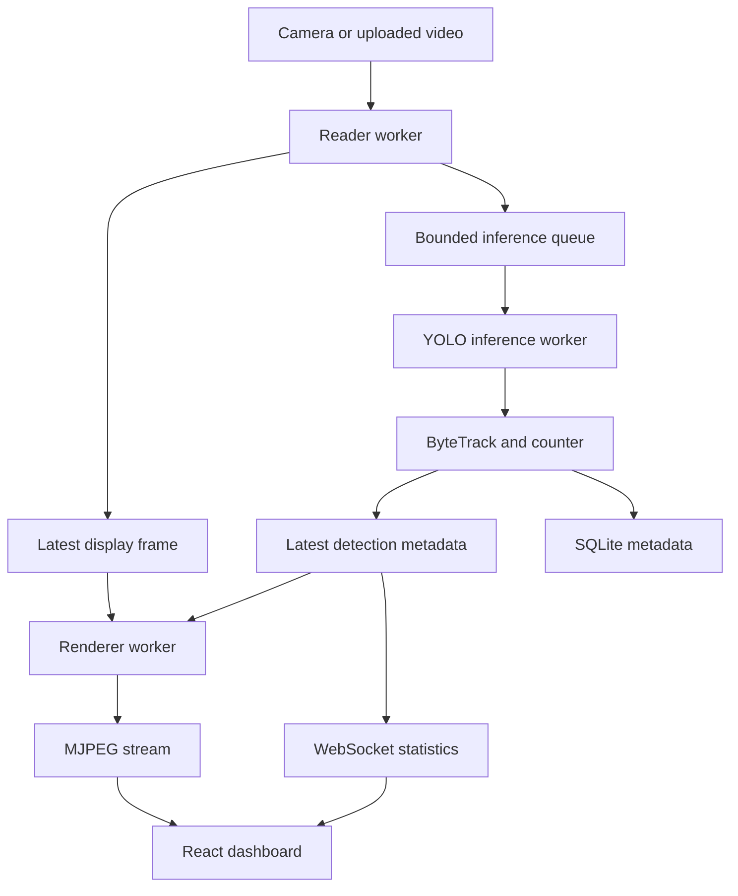

# Universal Vision Counter

**VisionCounter — Detect • Track • Count**

A runnable, local-first computer-vision workstation with a FastAPI backend, a React/TypeScript dashboard, pretrained YOLO11 nano, ByteTrack, SQLite analytics, and independent capture/inference/rendering workers. CPU is the default; a dedicated GPU is not required.

The ZIP contains backend and frontend source, the built frontend, the official `yolo11n.pt` pretrained checkpoint, tests, a sample image, and Windows/Linux startup scripts. No model training is needed.



## Quick start — Windows

1. Extract the entire ZIP to a writable folder, for example `F:\Projects\universal-vision-counter`.
2. Install **Python 3.12, 64-bit** (Python 3.11 is also supported). Install **Node.js 22 or 24 LTS** for frontend development.
3. Open PowerShell in the extracted folder:

```powershell
py -3.12 scripts\setup.py
.\start.bat
```

Or double-click `start.bat`; it runs setup on the first launch using `py -3.12`.

The browser opens at **http://127.0.0.1:8000**. Keep the terminal open; press Ctrl+C to stop the server. First-time installation requires internet access for Python dependencies. The pretrained model and built UI are included, so no npm build or model download is needed to use an intact release ZIP.

**Avoid Python 3.13/3.14 for this pinned release.** Use Python 3.11/3.12 to get compatible prebuilt packages instead of compiling numerical dependencies on Windows. The setup script installs CPU-only PyTorch explicitly.

For Python 3.11 on Windows, run `py -3.11 scripts\setup.py` once, then `start.bat`.

## Quick start — Linux

```bash
# Debian/Ubuntu system prerequisites (when not already installed)
sudo apt-get install python3.12-venv libgl1 libglib2.0-0

python3.12 scripts/setup.py
chmod +x start.sh
./start.sh
```

Your distribution may provide `python3-venv` instead. Use a supported Python interpreter. The setup script checks it before installation.

### Manual Python setup

```bash
python -m venv .venv
# Windows PowerShell:
.venv\Scripts\Activate.ps1
# Linux:
source .venv/bin/activate

python -m pip install --upgrade pip
pip install torch==2.14.1 torchvision==0.29.1 --index-url https://download.pytorch.org/whl/cpu
pip install -r requirements.txt
python scripts/download_model.py
python scripts/run.py
```

Use only the activation command for your operating system. If PowerShell blocks activation, directly use `.venv\Scripts\python.exe` rather than changing system policy.

### Frontend development

The built dashboard is already included. To edit and rebuild it:

```bash
npm install
npm run build
```

For hot reload, run the following in separate terminals:

```bash
python -m uvicorn backend.main:app --host 127.0.0.1 --port 8000
npm run dev
```

Open **http://127.0.0.1:5173**. Vite proxies `/api`, including WebSockets, to FastAPI. Restart FastAPI after creating the first frontend build, as the static mount is configured at startup. Do not copy `node_modules` between Windows and Linux; reinstall on the destination OS.

## First session

1. Open the dashboard. Click **Set up YOLO nano** to load the bundled pretrained model, or go to Settings → Model manager. If the checkpoint was removed, the same button downloads it from the official Ultralytics release.
2. Choose **Start camera**, **Upload image**, or **Upload video**.
3. Watch annotated frames, per-class counts and measured performance statistics.
4. Draw a count line or one or more polygon zones under the viewer.
5. Inspect Analytics and History; download CSV, JSON, snapshots or annotated video.

A quick image check is included: upload `tests/assets/bus.jpg`. For a generated sample video, run `python scripts/create_demo.py`; upload `outputs/demo.avi`. The demo pans a still photograph, so it is a functional test asset, not a real tracking benchmark.

## Features

| Area | Implemented behavior |
|---|---|
| Images | JPEG, PNG, WebP; original/annotated view; dynamic class counts; confidence and processing time; result download |
| Video | MP4, AVI, MOV, MKV, WebM as supported by OpenCV; asynchronous playback, pause/resume, seek, 0.5×–2× speed, fullscreen |
| Cameras | Local USB/laptop/external camera index; scan indices 0–3; configurable dimensions/FPS; Windows DirectShow backend |
| Models | Bundled pretrained YOLO11 nano; model load/switch/unload; compatible custom `.pt` checkpoints; runtime class discovery |
| Tracking | Real Ultralytics ByteTrack with a low-score association pass, session-scoped IDs, limited trails |
| Counting | Unique track total, per-class unique totals, current occupancy, finite line crossing, directional IN/OUT, multiple polygon zones |
| Visualization | Bounding boxes, IDs, confidence, centroids, motion trails, line and polygon overlays |
| Analytics | Live count chart, class donut, first-observation table, SQLite session history, runtime CPU/RAM/FPS/latency |
| Exports | Streaming CSV/JSON metadata, JPEG snapshots, live MJPG/AVI recording, full annotated AVI export |
| Settings | Persistent model, performance, camera, overlay and theme preferences; adaptive CPU processing |

## Architecture



The reader paces uploaded files using their source FPS and playback speed. It replaces old inference packets when the small queue is full. The inference worker drains to the freshest packet and processes at its own target frequency. The renderer continues independently at the configured display FPS using the latest raw frame and most recent boxes.

Display FPS is the **server's JPEG-render/encode rate**, not a claim about browser paint rate. Video FPS is actual reader throughput. Inference FPS and inference latency are measured separately. Boxes older than a short timeout are hidden. Between detections, overlays reuse their last measured coordinates; this release does not invent new observations with interpolation.

Only the latest frame, a 1–4 packet queue, recent results, 30-point trajectories, 30 recent observations, 180 chart samples and short timing windows live in memory. All detection history stays in SQLite; no entire video is accumulated in RAM.

### Project layout

```text
backend/
  main.py               FastAPI application, MJPEG, WebSocket, local-origin guard
  config.py             validated settings and region schemas
  service.py            single-session lifecycle and full-video exports
  api/                  image, video, camera, models, analytics/settings routes
  vision/               detector, ByteTrack adapter, counter, renderer and pipeline
  models/               restricted checkpoint model manager
  analytics/            SQLite repository
  utils/                structured logs, rate and adaptive controllers
frontend/src/
  App.tsx               dashboard navigation and workflow orchestration
  components/           viewer, charts, panels and settings
  hooks/                reconnecting WebSocket state
  services/             typed API client
models/                 pretrained/custom checkpoints
uploads/                uploaded source media
outputs/                annotated images, snapshots and exported videos
data/                   SQLite database and persisted preferences
tests/                  unit, integration and security checks
scripts/                setup, startup, demo and benchmark utilities
```

The repository centralizes persistence in `History`; a PostgreSQL repository can replace this boundary. Detector, tracker, counter and renderer are separate interfaces for future speed, heatmap, density or multi-camera modules. Those future modules are not implemented here.

## Counting semantics — read this before measuring

- **Unique tracks** count confirmed tracker IDs once within one session. Repeated frames of one ID do not add to the total.
- **Present now** is the occupancy in the latest inference result, not a new detection on every displayed frame.
- **Images** count individual detections in that still image. Image IDs are observation labels, not persistent identities.
- A class is fixed on the track's first confirmed observation to prevent fluctuating class predictions from shifting unique totals.
- ByteTrack is motion/appearance-overlap association, not universal physical-object re-identification. Long occlusions, scene cuts, similar objects and leaving/re-entering can create new IDs. Unique physical-object counts cannot be guaranteed by any setting in this release.
- An object must be seen in a processed inference frame. Aggressive frame skipping can miss brief appearances and fast crossings. Improve camera placement, lighting and inference frequency when counting accuracy matters.

### Line and IN / OUT

Draw two endpoints in image coordinates. The renderer displays an arrow from the first to the second endpoint. Positive directed-line side is **IN** and negative is **OUT**; for a left-to-right horizontal line, downward movement counts IN. Reverse the line to reverse direction.

Only a centroid movement segment crossing the finite line counts. Small near-line jitter is suppressed with an 0.8% normalized dead band and a 0.5-second debounce. A return crossing is a new flow event, while its track remains one unique object.

Estimated inside = `max(0, initial_inside + entered - exited)`. It is a flow estimate for the chosen line and initial occupancy. Use polygon occupancy when you need a direct count of currently visible objects in a region. Negative net flow is retained in JSON as `net_flow`.

Changing region geometry resets direction state and live IN/OUT counters. Unique-session counts remain intact; historical events remain in the database. The geometry change is logged as a `geometry_reset` event so exported consumers can separate configurations.

### Zones

Click three or more polygon boundary vertices and save. Use simple, non-self-intersecting polygons. Up to ten uniquely named zones are supported. Each zone displays current centroid occupancy; overlapping zones may contain the same object. Zone enter/exit events are stored in JSON. A track disappearing from the view is not automatically treated as a witnessed boundary crossing.

### Seek and session boundaries

Seeking explicitly starts a new counting session at the requested offset, avoiding duplicate totals from rewinding. Stop/start and changing media also start new sessions. Pause/resume keeps the same session and IDs. History preserves previous sessions.

## Custom model workflow

1. Stop the current analysis.
2. Open Settings → **Upload custom .pt model**.
3. Select a standard Ultralytics **object-detection** checkpoint, up to 100 MB.
4. The server validates and loads it using restricted `torch.load(weights_only=True)` with only installed neural-network types allowlisted.
5. Class names are taken from the checkpoint and the count cards update automatically. No COCO class list is hard-coded.

Models needing custom Python classes, legacy non-ZIP pickles, segmentation/pose/classification models and incompatible architectures are rejected with a clear error. Uploading `.pt` files never invokes unrestricted pickle loading. No dynamic imports are taken from an uploaded checkpoint. This protects against executable pickle payloads; it is not a hardened model-hosting sandbox for untrusted internet users.

Uploaded models receive server-generated filenames. Alternatively place a compatible `.pt` in `models/`, then refresh Settings and load it. Model configuration changes require stopping analysis. Compatible standard checkpoints work without application code changes; arbitrary custom architecture source does not.

## CPU performance

Default: **CPU, 416 px, confidence 0.35, NMS IoU 0.45, 24 display FPS, 8 inference FPS, 2 queued frames, 4 Torch threads, ByteTrack**.

| Preset | Inference size | Target inference FPS |
|---|---:|---:|
| Quality | 640 | 10 |
| Balanced | 416 | 8 |
| Performance | 320 | 5 |

The UI also supports 480 px. YOLO handles letterboxing and maps box coordinates to the source image. Rendered video is capped at 1920 px width, preserving aspect ratio.

Adaptive mode examines actual system CPU usage at most every five seconds: >60% lowers target inference rate; >80% also caps size to 416; >90% caps to 320 and reduces target rate further. Recovery requires CPU below 55%, avoiding rapid oscillation. Your configured values remain the upper limits. Stop analysis to change those base values.

On a weak CPU: choose Performance, reduce camera resolution/FPS, close heavy programs, and test the effect on missed detections. A queue always drops stale packets rather than accumulating delay. 20+ display FPS and 5–10 inference FPS are targets, not hardware-independent guarantees.

```bash
python scripts/benchmark.py --video outputs/demo.avi --seconds 5
```

The benchmark prints actual reader/render/inference rates, latency, queue drops and process RAM. No benchmark number is seeded into the dashboard.

### Optional GPU

Install matching CUDA-enabled PyTorch/torchvision wheels separately using the official PyTorch installation instructions, then select `CUDA GPU` in Settings. The bundled setup intentionally installs CPU wheels. GPU operation was not tested in this environment.

## Video/audio/export details

- MJPEG transports binary JPEG frames; analytics use WebSockets. No base64 frame REST polling is used.
- Uploaded-video audio uses a separate native browser audio element synchronized to the analysis timeline. It starts muted. Use the volume slider to enable it. Audio is available only for codecs your browser supports; AVI/MKV audio may not play. Camera streams carry no audio.
- **Record** captures rendered frames to MJPG/AVI at the display target FPS. Stop recording to finalize and download it. Paused periods are omitted.
- **Export full video** stops interactive analysis and renders the complete source to MJPG/AVI in a background worker, reporting progress. It uses a fresh tracker/session and sampled inference; every source frame is written, including reused overlays between inference passes.
- Annotated AVI exports and recordings are video-only. Original audio is not muxed into them. VLC or another MJPG-capable player can play the downloaded file.
- CSV/JSON stream metadata in batches, avoiding loading the entire session into RAM. Box and centroid coordinates are normalized to `[0,1]`; timestamps are Unix seconds, with a separate source-time field.

## API

Interactive documentation: **http://127.0.0.1:8000/docs**.

| Method | Endpoint | Purpose |
|---|---|---|
| GET | `/api/health` | Health and active model |
| GET / POST | `/api/models`, `/api/models/load` | List/load checkpoints |
| POST | `/api/models/pretrained`, `/api/models/upload`, `/api/models/unload` | Install/upload/unload |
| POST | `/api/detection/image` | Multipart image detection |
| POST | `/api/video/upload`, `/api/video/start`, `/api/video/stop` | Video lifecycle |
| POST | `/api/video/control` | Pause/resume/seek/speed |
| GET / POST | `/api/video/export` | Full annotated export progress/start |
| GET / POST | `/api/camera`, `/api/camera/start`, `/api/camera/stop` | Discover/start/stop camera |
| GET | `/api/stream` | Binary MJPEG stream |
| WS | `/api/ws` | Live metadata, approximately 3 updates/second |
| GET | `/api/stats`, `/api/counts`, `/api/history` | Current analytics and saved sessions |
| GET / POST / DELETE | `/api/counting`, `/api/counting/line`, `/api/counting/zone` | Read/draw/clear regions |
| GET / PUT | `/api/settings` | Persisted performance and camera settings |
| PUT | `/api/overlays`, `/api/theme` | Immediate display settings |
| POST | `/api/snapshot`, `/api/record` | Capture results |
| GET | `/api/export/{session_id}.csv` or `.json` | Metadata exports |

## Tests and verification

```bash
python -m pytest -q
npm run build
```

Tests cover repeated IDs over 100 frames, ten/five/three entering/leaving counts, class jitter, finite bidirectional line crossings, dead band, zones, trajectory bounds, real ByteTrack association, safe custom model loading, rejection of executable pickle payloads, API validation, WebSocket statistics, actual pretrained image inference, pause/seek/record/full-video export and a deliberately slow inference worker.

See **docs/VALIDATION.md** for the actual checks completed for this release and what still depends on your local hardware. Tests write temporary database data and may create images/videos in `uploads/` and `outputs/`; remove them after testing if desired.

## Security and deployment scope

This is a **single-user local workstation application**. Startup binds to 127.0.0.1, with same-origin request checks, local host validation, server-generated upload paths, file/size validation, restricted model deserialization and formula-safe CSV strings. There is no remote-user authentication or multi-tenant isolation. Keep the default loopback binding; a public service needs a separate deployment design.

SQLite, media and models stay on disk on this machine. The UI uses system fonts and bundled assets and does not upload your media to an external service. Initial dependency/model installation uses package repositories and the official model release.

Docker is optional:

```bash
docker compose up --build
```

The published port remains loopback-only. On native Linux, uncomment `/dev/video0` in Compose for camera access. Windows/macOS Docker Desktop does not automatically forward USB webcams; run the native Python setup for those cameras. Docker build and physical webcam/GPU tests were not performed in the build environment.

## Troubleshooting

| Problem | What to do |
|---|---|
| Python tries compiling NumPy/Torch | Recreate `.venv` using Python 3.11/3.12 64-bit and rerun setup. Do not reuse a 3.14 environment. |
| `py` not found on Windows | Install Python with its launcher, or run the full path to Python 3.12 with `scripts/setup.py`. |
| Camera unavailable | Close other camera apps, grant OS camera permission, select another index, and use native Python rather than Docker Desktop. |
| Corrupt/unsupported video | Try H.264 MP4 or MJPG AVI. Available codecs depend on the OpenCV wheel and OS. |
| Model missing | Load the bundled `models/yolo11n.pt` or use Install YOLO11 nano in Settings. |
| Custom model rejected | Use a standard Ultralytics detection checkpoint without custom Python code; check its format/size and installed Ultralytics version. |
| Slow or lagging boxes | Reduce inference size or target FPS; inspect actual latency and dropped-frame metrics. Sparse inference can reduce count accuracy. |
| Frontend cannot connect | Start the backend on port 8000. Use localhost or 127.0.0.1; development UI must run on port 5173. |
| Port 8000 already in use | Stop the earlier process before launching another copy. Use one worker and one server instance. |
| Stuck model switch | Stop analysis and let any export finish; the model lock protects active inference. |
| AVI has no audio | Expected: annotated exports are video-only. The original uploaded source is unchanged. |
| RAM shows N/A | The OS could not provide process RSS. Detection keeps running and no memory statistic is fabricated. |
| Disk fills over time | Stop the app, back up needed sessions, then remove unneeded `uploads/`, `outputs/` and old database data. History is persisted, not automatically deleted. |

## References

- Ultralytics tracking: https://docs.ultralytics.com/modes/track/
- YOLO11 models: https://docs.ultralytics.com/models/yolo11/
- PyTorch serialization: https://pytorch.org/docs/stable/notes/serialization.html
- FastAPI: https://fastapi.tiangolo.com/

See LICENSE and NOTICE.md for redistribution information.
